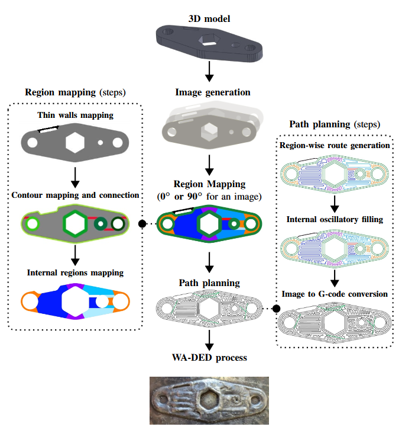

# DED-IM: A Novel Method for Mapping and Path Planning in Wire Arc Directed Energy Deposition



## Authors

[Matheus Antunes Chipanski](https://github.com/machipanski)

[Rodrigo Minetto](https://github.com/rminetto)

# DED-IM
This project is a novel image-based mapping and tool-path planning method for Wire Arc Directed Energy Deposition (WA-DED). The method automatically segments 3D models into distinct regions such as thin walls, contours, bottlenecks, and large internal areas by processing binary images. These segments enable precise, geometry-tailored tool-path generation, significantly improving control over material deposition and reducing arc interruptions. Key innovations include the application of medial axis transforms to accurately map thin walls, the introduction of oscillatory paths for bottleneck areas, and an adaptive weaving pattern that minimizes voids while enhancing geometric precision. The method also integrates user-defined parameters, offering flexibility in region mapping and filling strategies to address specific manufacturing requirements. Experimental results demonstrate the efficacy of DED-IM, showing substantial reductions in common defects such as voids, insufficient material filling, and arc interruptions.

Developed in Python, the method takes a 3D model as input, along with machine-specific parameters, and generates G-code instructions that can be customized for different WA-DED machines. DED-IM automatically segments 3D models into regions like thin walls, contours, bottlenecks, and large internal areas by processing binary images. These parameters are fully adjustable, allowing users to tailor the tool-path strategy to their specific needs. The modular design also makes it easy to integrate new strategies, such as custom zigzag patterns. To use DED-IM in a production workflow, practitioners will need to adjust the software according to their machine specifications.

# Using the Program

To use the program, simply execute the cells in the Jupyter Notebook file named `main.ipynb` in sequence. The program processes each step to generate a structured `.hdf5` file, culminating in the creation of a Gcode file containing the generated paths.

## Mapping

### Step 1: Input and Initial Processing

The first cell prompts you to input an `.stl` or `.pgm` file. It then utilizes the [Optimal Algorithm for 3D Triangle Mesh Slicing](https://github.com/rminetto/slicing) project to generate images for each layer. These images are used to create a `.hdf5` file, which stores the structural visualization of the layers along with their properties.

### Step 2: Thin Wall Detection

The second cell identifies thin features in the images that might disappear if an offset operation is performed. These regions, known as `Thin Wall regions`, are enclosed as geometric shapes within each layer. The detected regions are saved back into the `.hdf5` file, and you can visualize the mapped regions for each layer.

### Step 3: Contour and Void Analysis

The third cell requests input for the maximum number of contours allowed and the maximum size of void elements tolerated in the process. It then calculates the maximum number of contours that can be generated without exceeding the acceptable void size relative to the melting pool area. The resulting areas are referred to as `Offset Regions`.

### Step 4: Contour Connections and Bottleneck Detection

The fourth cell generates connections between internal and external contours, creating `Offset Bridges`. These bridges are later used as part of the contour, reducing the need to interrupt material deposition. Additionally, it scans the areas within the contours to identify any potential bottlenecks in the internal filling process.
The new `Bottleneck regions` are again separated from the rest of the image as spaces to utilize different filling strategies. 

If there is any superposition between Offset Bridges and Bottleneck regions, the Bottleneck is denominated `Crossover Bridge` and is included into the contours path planning. Otherwise the Bottleneck regios is a `Zigzag Bridge` and is included into the internal filling path planning.

### Step 5: Zigzag regions

The last regions to be mapped are processed in the fifth cell. Any area big enought is now divided by monotonic areas in the orientation of the raster of an zigzag-style filling strategy. 

### Step 6: Mapping visualization

Every layer is shown as a combination of its mapped regions: blue for Zigzags, black for Thin Walls, green for Offsets, purple for Zigzag bridges, red for Offset bridges and orange for Crossover bridges.

## Path Plannig

### Step 7: Individual Offset routes

### Step 8: Individual Bridges routes

### Step 9: Individual Zigzag routes

### Step 10: Internar weaving

### Step 11: Individual Thin wall routes

### Step 12: Paths Start and End definition for each island

### Step 13: External routes unification

### Step 14: Internal routes unification

### Step 15: Thin walls integration

### Step 16: Final route

### Step 17: G-code generation

## Example Models

There are single-layer simulations represented by single images into the  `<your-local-repository>/input` folder.
The 3D models used to test the algorithm are all present into the  `<your-local-repository>/input/stl_models` folder.

**Atention:** Due to the stert of the process relying on a older version of the `slicing with images` project, some of the models can be rotated to diferent positions, so it may be necessary to save the models in different orientations before generating the desired slices.


## Outputs

# Useful stuff

The site for the `.hdf5` file visualizer is [here](https://www.hdfgroup.org/solutions/hdf5/)

```shell
python generate_nonfire_masks.py
```

# Environment preparation

The scripts in this repository were done using Tensorflow (GPU) version 1.13, using Keras 2.2 version. Since there are some Nvidia-drivers/CUDA/TensorFlow specific installation details we don't provide any enviroment preparation file, but the main libriries used are:
```
tensorflow-gpu
keras
numpy
cv2
scikit-learn
pandas
geopandas
rasterio
```
If you want to use TensorFlow 2.X you can follow some hints in the [tensorflow-2.md](tensorflow-2.md) file.


# Citation

If you find our work useful for your research, please [cite our paper](https://www.sciencedirect.com/science/article/abs/pii/S092427162100160X):

```
@article{DEALMEIDAPEREIRA2021171,
title = {Active fire detection in Landsat-8 imagery: A large-scale dataset and a deep-learning study},
journal = {ISPRS Journal of Photogrammetry and Remote Sensing},
volume = {178},
pages = {171-186},
year = {2021},
issn = {0924-2716},
doi = {https://doi.org/10.1016/j.isprsjprs.2021.06.002},
url = {https://www.sciencedirect.com/science/article/pii/S092427162100160X},
author = {Gabriel Henrique {de Almeida Pereira} and Andre Minoro Fusioka and Bogdan Tomoyuki Nassu and Rodrigo Minetto},
keywords = {Active fire detection, Active fire segmentation, Active fire dataset, Convolutional neural network, Landsat-8 imagery},
}
```

Or access the [preprinted version](https://arxiv.org/abs/2101.03409).


# License

This work is licensed under a
[Creative Commons Attribution 4.0 International License][cc-by].

[![CC BY 4.0][cc-by-image]][cc-by]

[cc-by]: http://creativecommons.org/licenses/by/4.0/
[cc-by-image]: https://i.creativecommons.org/l/by/4.0/88x31.png
[cc-by-shield]: https://img.shields.io/badge/License-CC%20BY%204.0-lightgrey.svg


