# DED-IM: A Novel Method for Mapping and Path Planning in Wire Arc Directed Energy Deposition

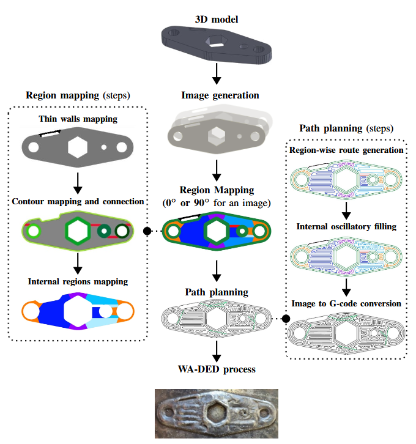

## Authors

[Matheus Antunes Chipanski](https://github.com/machipanski)

[Rodrigo Minetto](https://github.com/rminetto)

# DED-IM
This project is a novel image-based mapping and tool-path planning method for Wire Arc Directed Energy Deposition (WA-DED). The method automatically segments 3D models into distinct regions such as thin walls, contours, bottlenecks, and large internal areas by processing binary images. These segments enable precise, geometry-tailored tool-path generation, significantly improving control over material deposition and reducing arc interruptions. Key innovations include the application of medial axis transforms to accurately map thin walls, the introduction of oscillatory paths for bottleneck areas, and an adaptive weaving pattern that minimizes voids while enhancing geometric precision. The method also integrates user-defined parameters, offering flexibility in region mapping and filling strategies to address specific manufacturing requirements. Experimental results demonstrate the efficacy of DED-IM, showing substantial reductions in common defects such as voids, insufficient material filling, and arc interruptions.

Developed in Python, the method takes a 3D model as input, along with machine-specific parameters, and generates G-code instructions that can be customized for different WA-DED machines. DED-IM automatically segments 3D models into regions like thin walls, contours, bottlenecks, and large internal areas by processing binary images. These parameters are fully adjustable, allowing users to tailor the tool-path strategy to their specific needs. The modular design also makes it easy to integrate new strategies, such as custom zigzag patterns. To use DED-IM in a production workflow, practitioners will need to adjust the software according to their machine specifications.

# Limitations and upgrades

New features have been added since the publication of the original paper. As a result, the outcomes of the current versions may differ from those reported in the paper. These new features address special cases that were not covered in previous versions, such as:

    Handling situations where multiple paths converge (ongoing development), among other edge cases.

    Support for the .hdf5 format, allowing progress to be saved between processing steps and enabling the execution of different parts of the algorithm with distinct configurations.

    Introduction of the welding_config.yaml file to ensure parameter consistency and improve the organization of welding profiles.

# Getting Started

To ensure you have the best experience with this algorithm, we recommend setting up a fresh conda environment. We’ve included a requirements.txt file with all the necessary dependencies, so you can quickly install everything needed for the project to run as intended.

```shell
conda create --name DED_IM --file requirements.txt python=3.11.9 
conda activate DED_IM
```

## Environment preparation

If still needed after the instalation as above, the main libraries used in this project are:

```
ast
bdb
cv2
concurrent.futures
datetime
h5py
itertools
keyring
matplotlib
networkx
numpy
os
random
re
scipy
skimage
subprocess
tkinter
unittest
yaml
```

# Using the Program

To use the program, simply execute the cells in the Jupyter Notebook file named `main.ipynb` in sequence. The program processes each step to generate a structured `.hdf5` file, culminating in the creation of a Gcode file containing the generated paths.

## Weding programs configurations

Most of the steps will ask for a program and strategy of the deposition used. The `welding_config.yaml` file keeps a register of all configurations used and there is allways a option to register a new program.

```shell
- bead_diameter: 6
  bead_superposition: 50
  filling_strategy: offsets
  name: offsets padrao
  off_pause: 600.0
  on_pause: 800.0
  travel_speed: 360.0
  used_region: contours
  voltage: 16.6
  wire_speed: 1.8
```

## Mapping

### Step 1: Input and Initial Processing

The first cell prompts you to input an `.stl` or `.pgm` file. It then utilizes the [Optimal Algorithm for 3D Triangle Mesh Slicing](https://github.com/rminetto/slicing) project to generate images for each layer. These images are used to create a `.hdf5` file, which stores the structural visualization of the layers along with their properties.

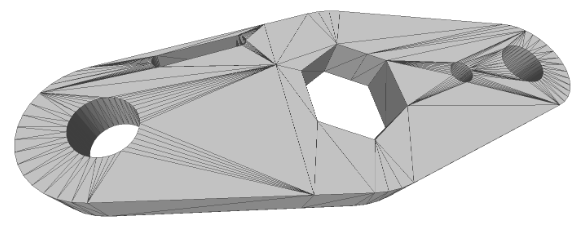 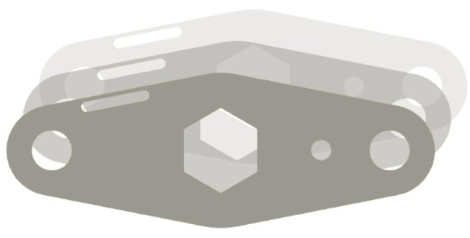


### Step 2: Thin Wall Detection

The second cell identifies thin features in the images that might disappear if an offset operation is performed. These regions, known as `Thin Wall regions`, are enclosed as geometric shapes within each layer. The detected regions are saved back into the `.hdf5` file, and you can visualize the mapped regions for each layer.

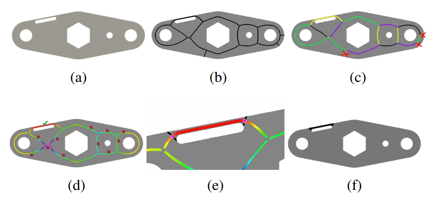

### Step 3: Contour and Void Analysis

The third cell requests input for the maximum number of contours allowed and the maximum size of void elements tolerated in the process. It then calculates the maximum number of contours that can be generated without exceeding the acceptable void size relative to the melting pool area. The resulting areas are referred to as `Offset Regions`.

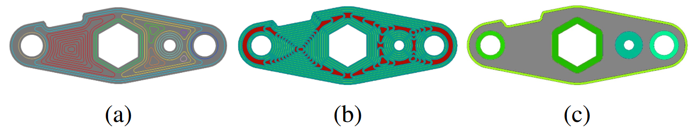

### Step 4: Contour Connections and Bottleneck Detection

The fourth cell generates connections between internal and external contours, creating `Offset Bridges`. These bridges are later used as part of the contour, reducing the need to interrupt material deposition. Additionally, it scans the areas within the contours to identify any potential bottlenecks in the internal filling process.
The new `Bottleneck regions` are again separated from the rest of the image as spaces to utilize different filling strategies. 

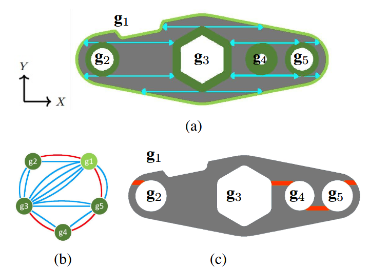

If there is any superposition between Offset Bridges and Bottleneck regions, the Bottleneck is denominated `Crossover Bridge` and is included into the contours path planning. Otherwise the Bottleneck regios is a `Zigzag Bridge` and is included into the internal filling path planning.

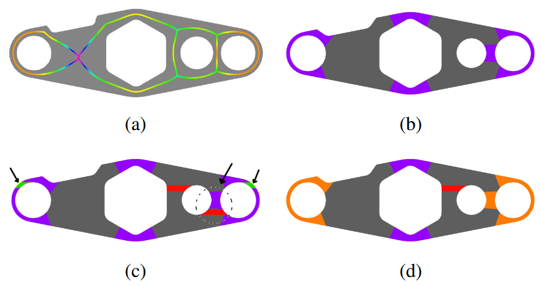

### Step 5: Zigzag regions

The last regions to be mapped are processed in the fifth cell. Any area big enought is now divided by monotonic areas in the orientation of the raster of an zigzag-style filling strategy. 

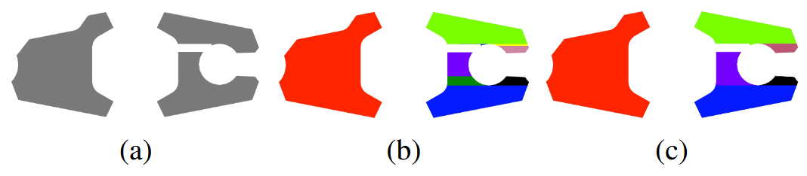

### Step 6: Mapping visualization

Every layer is shown as a combination of its mapped regions: blue for Zigzags, black for Thin Walls, green for Offsets, purple for Zigzag bridges, red for Offset bridges and orange for Crossover bridges.

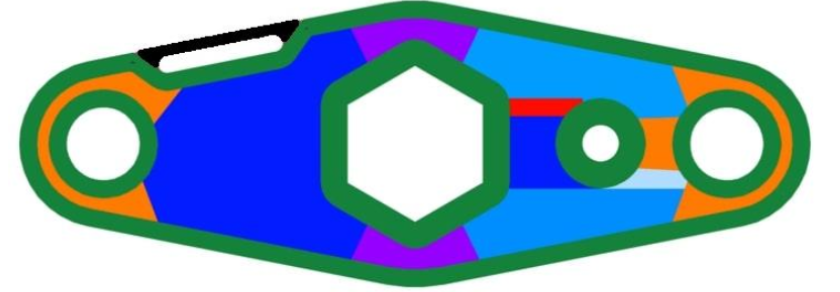

## Path Plannig

### Step 7: Individual Offset routes

Every offset region is individualy divided by the sequential contours with an offset defined by the configurations in the `welding_config.yaml` file. After this, each region has its loops connected in order to generate a closed-loop unique route. 

> [!NOTE]
> The filling strategies pesent in this version of the code are still been studied. We plan to implement different choices of compactible strategies for each region

### Step 8: Individual Bridges routes

The generation of routes for Offset bridges is a simple pair of traces in order to connect the two regions it connects.

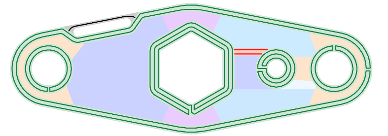

Zigzag bridges are filled with a weaving pattern, folowing the direction between the Zigzag regions they connect.

Crossover Bridges are filled with the same weaving pattern, but the ends of the lines are directly directed to stay the closest possible to each o the Offset regions each bridge connects.

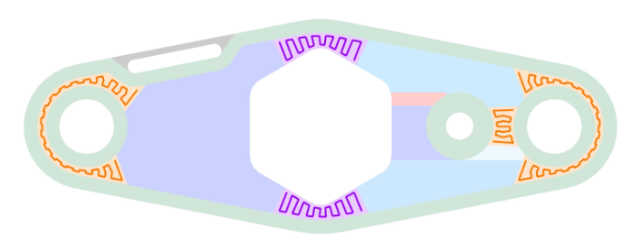

### Step 9: Individual Zigzag routes

The following step generate special zigzag routes known as `go and back zigzags`, as developed by the [works of Yan Jin, Yong He et. all](https://www.sciencedirect.com/science/article/abs/pii/S0736584516302654?via%3Dihub) for each nonotonic area previously separated. This helps to create continuous routes inside the iternal filling in future steps

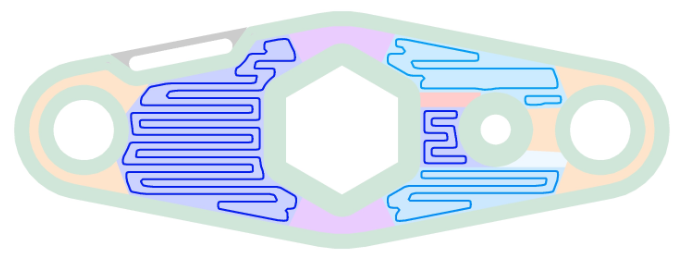

### Step 10: Internal weaving

The generation of go and back zigzags can create some voids inside the internal areas due to the need of creating space for pairs of routes inside every area. In order to avoid the need to interrupt the deposition and repositioning the welding torch, we created a secondary pattern that changes some sections of the zigzags to perpendicular `internal weaving patterns`.

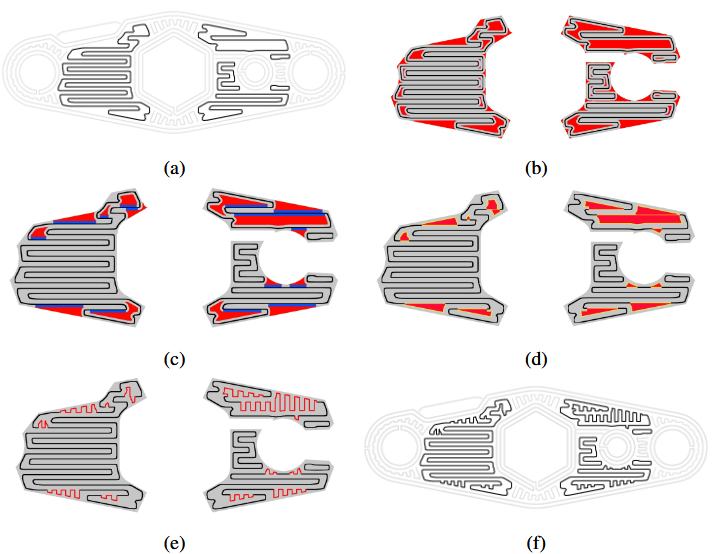

Each zigzag region route is then modified to provide the maximum filling path coverage possible.

### Step 11: Individual Thin wall routes

Each thin wall region generates a route following its medial axis with a single path. One of the future developments scheduled if the generation of thin wall routes with optimizations for the sequences and intesections of these routes.

### Step 12: Start definition for each island routes

In this cell, all generated routes for each layer are separated between `internal`, `external` and `thin walls`. As a measure to reduce the effets of the start of the electric arc in each layer and island, a randon point of each external route - the closest possible to the respective internal routes the better - is selected as the start of the routes. The closest internal point is selected as the star of the internal route as well.

`External routes` includes ofset regions, offset bridges and crossover bridges.

`Internal routes` includes zigzag regions and zigzag bridges.

`Thin wall routes` are all grouped separated, once they are expected to be executed last.

### Step 13: External routes unification

At this part of the program, by following the sequence of pixels that forms the first outer contour, the algorithm seaches for the points closest to the first and the last time every bridge touches the ofset route. Every time the algorithm detects the second contact, it concatenates the offset region that this bridge connects and the bridge route.

By following this sequence until there is no more bridges, all external routes in an island are connected in a single sequence of pixels. This sequencing aims to reduce the interruptions needed to generate the contours of the layer. At the same time, using the second contact of each bridge, it ensures offset routes are mede before any weaving route. This is because we observed best results are obtained when weaving routes are made between previously deposited routes.

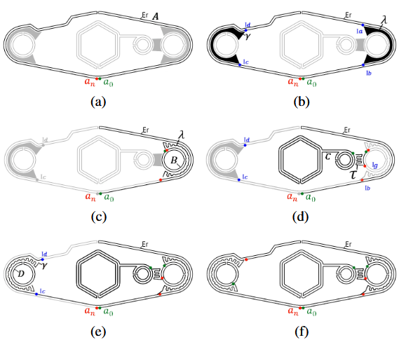

### Step 14: Internal routes unification

After the external routes are connected, the intenal areas folow the idea. As every zigzag area is filed with closed loops routes, neighbor regions can be connected by a pair of parallel lines, so the internal routes are all connected in a single sequenco of points as well.

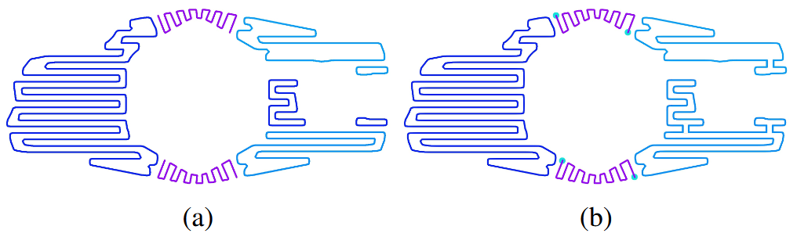

> [!NOTE]
> As it can be seen in the images, crossover and zigzag bridges can only be produced by advancing in a certain direction and not by pairs of routes because of the space limmitations. This means that, at this moment of development, it is needed the an jump is introduced for each of these routes. 

### Step 15: Thin walls integration

All thin wals routes are added in the last part of the layer printing. The reason of this is beceuse its extected that at this time all possible parts of the layer could offer the most support for start and endings of the single routes. By this way offering, if possible, some same-layer material to melt and anchor the possible most fragile routes.

### Step 16: Final route

The last part of preparing the routes is to sequence every island`s external routes, including signal for any interruption of the ark - if there is any - followed by the internal routes. After all islands have their routes, the thin walls are added. 

By this part of the code, the sequences of coordinates are simplified into segments, so it can be better processed by the printer`s buffer.

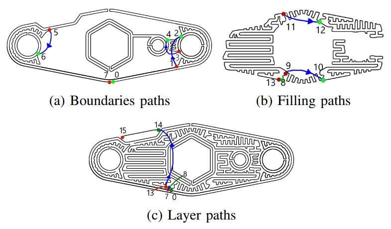

### Step 17: G-code generation

The last part translates the sequence of coordinates into Gcode machine commands. Every signalized start and end of routes is used to send the following commands for the printer:

```shell
;-------Turn OFF Welding------
M42 P4 S255
G4 P700.0

;-------Turn ON Welding------
M42 P4 S0
G4 P700.0
```

The `M42` command may be addapted for your printer.

The `G4` command is affected by the `welding_config.yaml` file for each different mapped area. And reffers to the pre-gas and star or ending of the soldering process, keeping the torch at the same place.

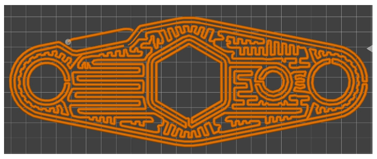

## Example Models

There are single-layer simulations represented by single images into the  `<your-local-repository>/input` folder.
The 3D models used to test the algorithm are all present into the  `<your-local-repository>/input/stl_models` folder.

**Atention:** Due to the stert of the process relying on a older version of the `slicing with images` project, some of the models can be rotated to diferent positions, so it may be necessary to save the models in different orientations before generating the desired slices.

<!-- 
## Outputs
-->

# Useful stuff

The site for the `.hdf5` file visualizer is [here](https://www.hdfgroup.org/solutions/hdf5/)

<!--
```shell
python generate_nonfire_masks.py
```
-->

# Citation

If you find our work useful for your research, please [cite our paper](https://ieeexplore.ieee.org/document/10935302):

```
@ARTICLE{10935302,
  author={Chipanski, Matheus Antunes and Da Silva, Tadeu Castro and Volpato, Neri and Da Silva, Ricardo Dutra and Duarte, Valdemar Rebelo R. and Santos, Telmo G. and Minetto, Rodrigo},
  journal={IEEE Transactions on Automation Science and Engineering}, 
  title={DED-IM: A Novel Method for Mapping and Path Planning in Wire Arc Directed Energy Deposition}, 
  year={2025},
  volume={22},
  number={},
  pages={13286-13297},
  keywords={Filling;Three-dimensional displays;Solid modeling;Shape;Path planning;Image segmentation;Geometry;Automation;Transforms;Surface treatment;Wire Arc Directed Energy Deposition;Region mapping;Path planning;Image processing;Geometry decomposition;Image-based tool-path},
  doi={10.1109/TASE.2025.3553309}}
```

New features had been added after the writing and publishing process of the article, the most important of them are:
  - The use of the .hdf5 format, enabling saving the progress between cells and the possibility to execute different parts of the algorithm with different settings.
  - The welding_config.yaml file now is used as a way to grant more consistency of the parameters used and keep the soldering profiles better organized
  - 
  -
# License

<!-- This work is licensed under a
[Creative Commons Attribution 4.0 International License][cc-by].

[![CC BY 4.0][cc-by-image]][cc-by]

[cc-by]: http://creativecommons.org/licenses/by/4.0/
[cc-by-image]: https://i.creativecommons.org/l/by/4.0/88x31.png
[cc-by-shield]: https://img.shields.io/badge/License-CC%20BY%204.0-lightgrey.svg

 -->

[](https://creativecommons.org/licenses/by-nc-sa/4.0/)

This work is licensed by [Creative Commons Attribution-NonCommercial-ShareAlike 4.0 International License](https://creativecommons.org/licenses/by-nc-sa/4.0/).